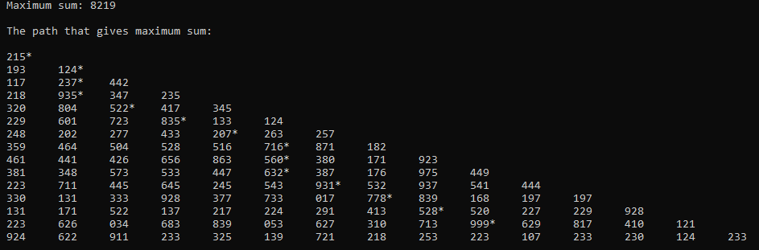

# Max Sum Of Single Path In Pyramid
An Algorithm Challenge

## Problem
We will have an orthogonal triangle input and need to find the maximum sum of the single path according to given rules below;

1. Only allowed to walk downwards and diagonally.
2. Only walk over NON PRIME NUMBERS.
3. Have to reach at the end of the pyramid as much as possible.
4. Have to treat the input as pyramid.

According to above rules the maximum sum of the numbers from top to bottom in below example is 24.

<pre>
	1*
       4  9*
      4  2  9*
     8  5  3  3
</pre>

As we can see this has several paths that fits the rule of NOT PRIME NUMBERS; 1>4, 1>4>4, 1>4>4>8, 1>9, 1>9>9\
1 + 9 + 9 = 19.  As you see 1, 9, 9 are all NOT PRIME NUMBERS and walking over these yields the maximum sum.

## Solution
<pre>
									Find max child element		Repeat until reaching
					    Add zero where		for each parent element	        to the last row		
					    number is prime		And add parent value to		
					    				child element							
					    					
1	     To Matrix \	1 0 0 0     	        \	1 0 0 0   for 3. row\	     1  0  0  0  for 2. row\	     1  0  0  0   for 1st row\	     19 0  0  0  ===> Max Sum: 19
4 9	     ===========\	4 9 0 0	      ===========\	4 9 0 0   ===========\	     4  9  0  0  ===========\	     16 18 0  0    ===========\      16 18 0  0     			
4 2 9	     ===========/	4 2 9 0	      ===========/	4 0 9 0   ===========/       12 0  9  0  ===========/	     12 0  9  0	   ===========/      12 0  9  0	
8 5 3 3	       	       /	8 5 3 3		        /	8 0 0 0		    /	     8  0  0  0	           /	     8  0  0  0	             /       8  0  0  0

Pattern for finding the path:

Origin Matrix => 1  0  0  0
		 4  9  0  0    Take the first element to as main element
		 4  0  9  0    ===========================================>  1 <--------------Equal
		 8  0  0  0							    		|
										    		|			===> After this u can see that difference between sum matrix's first element and right child of it equals to first element of origin matrix.
									            		|  			===> It means that we've found the second element of path as second element of second row. 
Sum Matrix    => 19 0  0  0   Take the first element as max sum,find the difference 	    	|			===> And our new max sum is going to be max sum of second row for the process on next row. (In this example, new max sum Sum Matrix[1,1]=> 18 for second row)     
		 16 18 0  0   between max sum and child elements of max sum	    		v			===> And new main element is going to be => Origin Matrix[1,1] = 9.
		 12 0  9  0   ============================================>  19-16 = 2, 19-18 = 1			===> In this way, we can repeat this process until the difference is zero. 
	         8  0  0  0
</pre>

Input:

215\
193 124\
117 237 442\
218 935 347 235\
320 804 522 417 345\
229 601 723 835 133 124\
248 202 277 433 207 263 257\
359 464 504 528 516 716 871 182\
461 441 426 656 863 560 380 171 923\
381 348 573 533 447 632 387 176 975 449\
223 711 445 645 245 543 931 532 937 541 444\
330 131 333 928 377 733 017 778 839 168 197 197\
131 171 522 137 217 224 291 413 528 520 227 229 928\
223 626 034 683 839 053 627 310 713 999 629 817 410 121\
924 622 911 233 325 139 721 218 253 223 107 233 230 124 233

Output:

